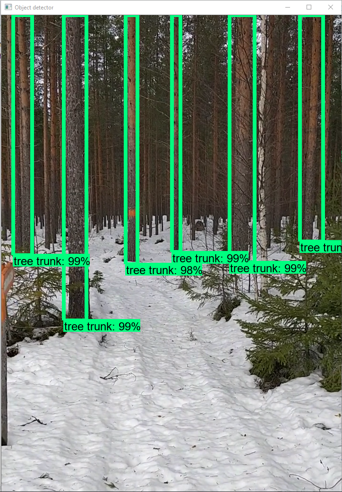

# Computer vision as a tool for forestry
In my bachelor thesis i selected four architectures (for computer vision) that have previously proven to perform well on a general dataset. These four architectures were configured to continue to train on trees and other objects in the forest. The trained architectures were tested by measuring frames per second (FPS) when performing object detection on a video and mean average precision (mAP) which is a measure of how well a trained architecture detects objects. The fastest one was an architecture using a Single Shot Detector together with MobileNet v2 as a base network achieving 29 FPS. The one with the best accuracy was using Faster R-CNN and Inception Resnet as a base network achieving 0.119 mAP on the test set.

Check out de whole thesis here: https://www.diva-portal.org/smash/record.jsf?pid=diva2:1323733 